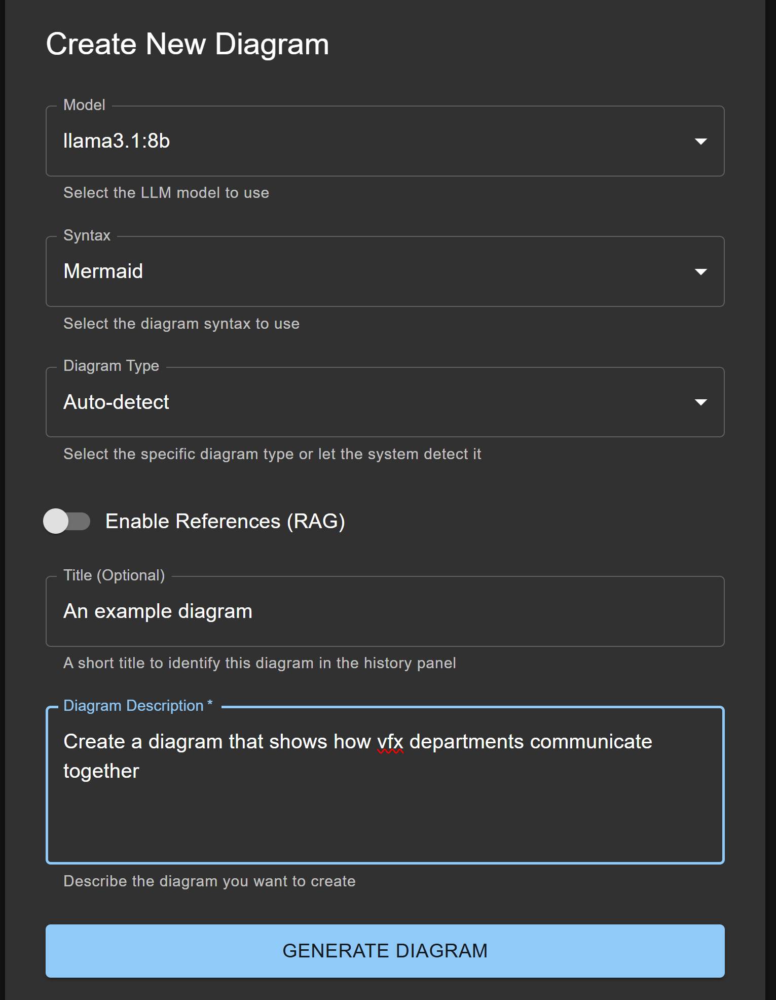
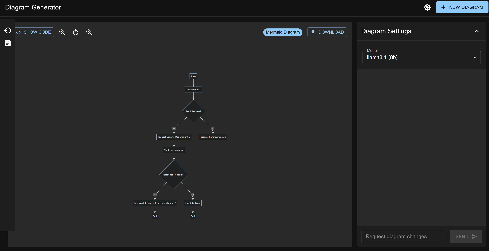
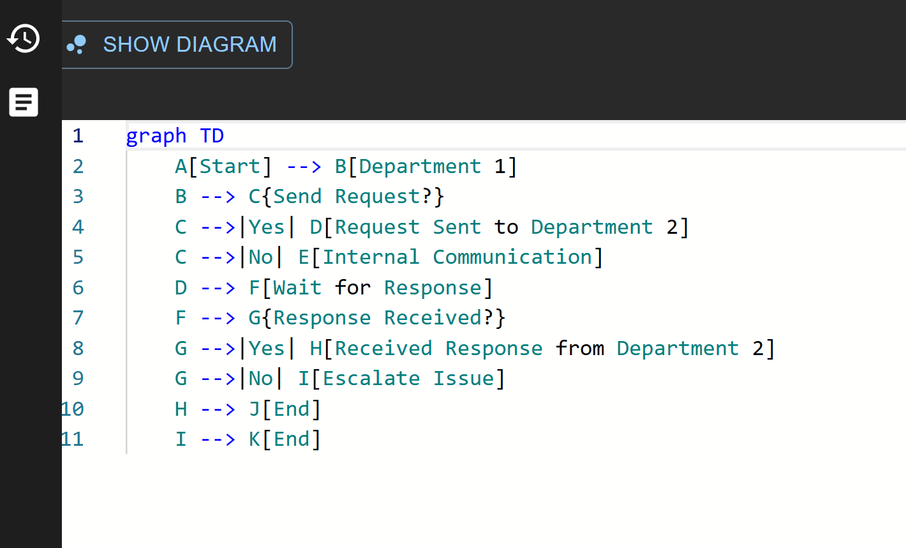
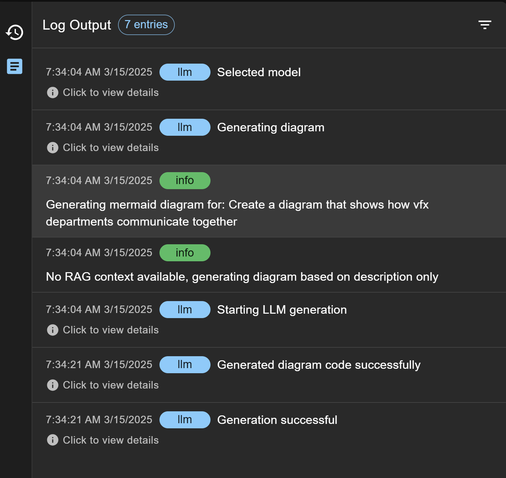

# Diagram Generator

A tool for generating diagrams using LLM, with a Python backend API and React frontend.






## Disclaimer

This project was an experiment in semi-autonomous and autonomous development for learning purposes, I take no responsibility of the code.

This tool may is not well tested or built for that matter.


## Project Structure

```
diagram_generator/
├── python/                  # Python package root
│   └── diagram_generator/   # Main Python package
│       ├── __init__.py
│       ├── backend/         # Backend API
│       └── ...
├── docs/                    # Documentation
├── tests/                   # Test suite
└── frontend/                # React frontend
```

## Installation

### Development Installation

1. Clone the repository:
   ```bash
   git clone https://github.com/yourusername/diagram_generator.git
   cd diagram_generator
   ```

2. Create a virtual environment:
   ```bash
   # Windows
   python -m venv venv
   venv\Scripts\activate
   
   # macOS/Linux
   python3 -m venv venv
   source venv/bin/activate
   ```

3. Install in development mode:
   ```bash
   pip install -e ".[dev]"
   ```

Alternatively run:
```bash
python run.py
```  
Which is a quick workaround for not having to deal with pip during development 

## Running the Application

### Quick Start (Recommended)

Run both the backend and frontend with a single command:

#### Using the CLI (After Installation)
```bash
# If you've installed the package
diagram-generator
```

#### Using Scripts (Development)

##### Windows
```powershell
# From the project root
.\scripts\run-app.ps1
```

##### macOS/Linux
```bash
# From the project root
chmod +x scripts/run-app.sh  # Make the script executable (first time only)
./scripts/run-app.sh
```

This will:
1. Create a Python virtual environment if it doesn't exist
2. Install the backend in development mode
3. Install frontend dependencies if needed
4. Start both the backend and frontend servers
5. Show combined logs from both servers

The application will be available at:
- Frontend: http://localhost:5173
- Backend API: http://localhost:8000

Press Ctrl+C to stop both servers.

The CLI provides additional options:
```bash
# Show help
diagram-generator --help

# Start only the backend
diagram-generator --backend-only

# Start only the frontend
diagram-generator --frontend-only

# Don't open browser automatically
diagram-generator --no-browser

# Use custom ports
diagram-generator --backend-port 8080 --frontend-port 3000
```

### Running Servers Separately

If you prefer to run the servers separately:

#### Backend API

```bash
# Using the console script
diagram-generator-backend

# Or using the Python module directly
python -m uvicorn diagram_generator.backend.main:app --reload
```

#### Frontend

```bash
cd frontend
npm install  # First time only
npm run dev
```

### API Documentation

Once the backend is running, API documentation is available at:
- Swagger UI: http://localhost:8000/docs
- ReDoc: http://localhost:8000/redoc

## Running Tests

```bash
# Run all tests
pytest

# Run with coverage report
pytest --cov=python/diagram_generator

# Run specific test module
pytest tests/test_main.py
```

## Project Organization

- **Backend API**: FastAPI application in `python/diagram_generator/backend/`
- **Documentation**: Project docs in `docs/`
- **Tests**: Test suite in `tests/`
- **Web Frontend**: React application with Material UI in `frontend/`
