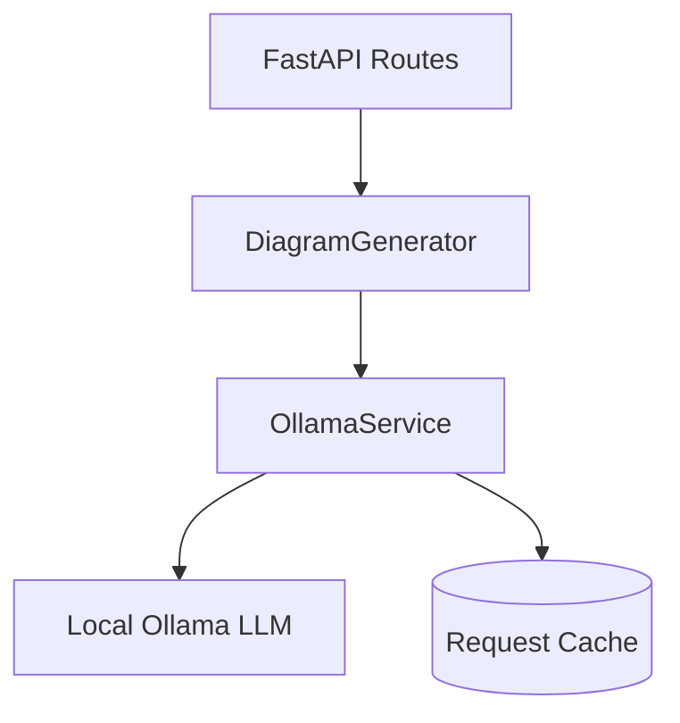
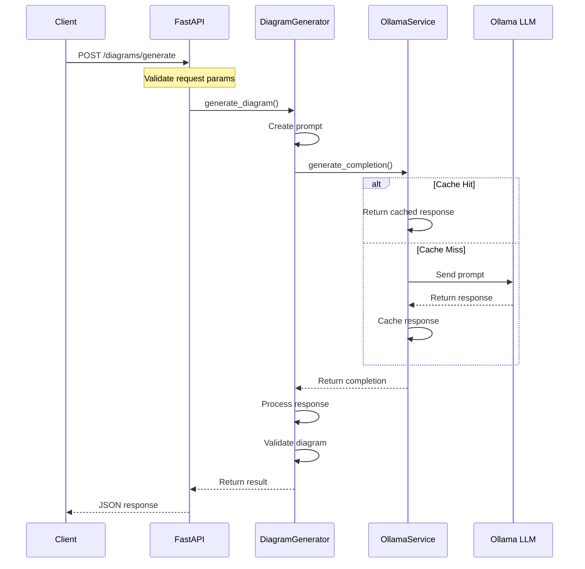
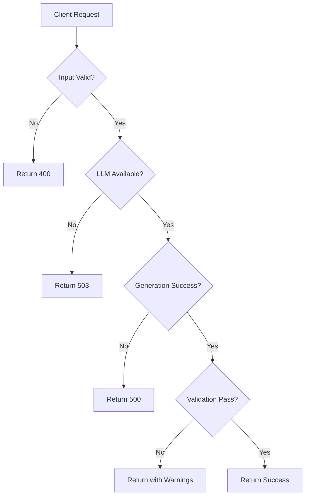

# Architecture Documentation

This document provides an overview of the core components and how they interact to deliver diagram generation, validation, and conversion services.

## System Architecture

### Components Overview

The system consists of three main layers:

1. **API Layer** (`backend/api/diagrams.py`)
   - FastAPI endpoints for diagram operations
   - Request/response handling
   - Input validation
   - Error handling

2. **Core Layer** (`backend/core/diagram_generator.py`)
   - Diagram generation logic
   - Prompt construction
   - Response processing
   - Validation orchestration

3. **Service Layer** (`backend/services/ollama.py`)
   - LLM communication
   - Response caching
   - Error handling
   - Response validation

### Component Details

#### FastAPI Routes
- Handles HTTP requests and responses
- Routes:
  - `/diagrams/generate`
  - `/diagrams/validate`
  - `/diagrams/convert`
- Input validation using FastAPI's type system
- Error handling with proper HTTP status codes

#### DiagramGenerator
- Central business logic component
- Responsibilities:
  - Building LLM prompts
  - Processing LLM responses
  - Extracting diagram code
  - Post-processing and cleanup
  - Validation orchestration

#### OllamaService
- LLM integration layer
- Features:
  - Request caching
  - Connection management
  - Response validation
  - Error handling

## Request Flow

### Diagram Generation Flow

### Error Handling Flow

## Key Design Decisions

1. **Async Operations**
   - All operations are async for better performance
   - Allows handling multiple requests efficiently

2. **Caching Strategy**
   - Uses `requests_cache` for LLM responses
   - Configurable cache duration
   - Improves response times for repeated requests

3. **Error Handling**
   - Graceful degradation
   - Detailed error messages
   - Proper HTTP status codes

4. **Response Processing**
   - Markdown extraction
   - Code formatting
   - Validation checks

## Testing Strategy

1. **Unit Tests**
   - Individual component testing
   - Mock LLM responses
   - Error case coverage

2. **Integration Tests**
   - API endpoint testing
   - End-to-end flows
   - Error handling verification

3. **Test Coverage**
   - Core business logic
   - API endpoints
   - Service layer

## Future Considerations

1. **Scalability**
   - Load balancing
   - Multiple LLM instances
   - Distributed caching

2. **Security**
   - Authentication
   - Rate limiting
   - Input sanitization

3. **Monitoring**
   - Performance metrics
   - Error tracking
   - Usage statistics

4. **Extensions**
   - Additional diagram types
   - Custom validation rules
   - Collaborative features
