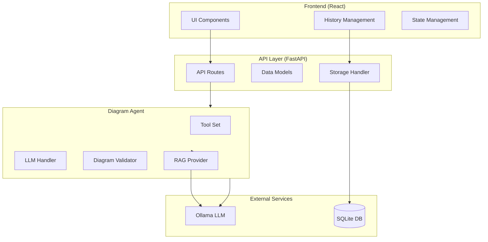
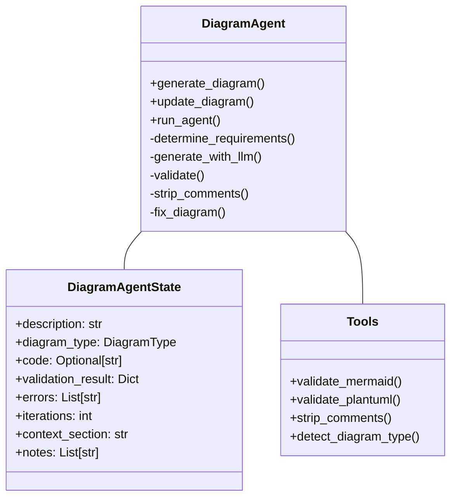
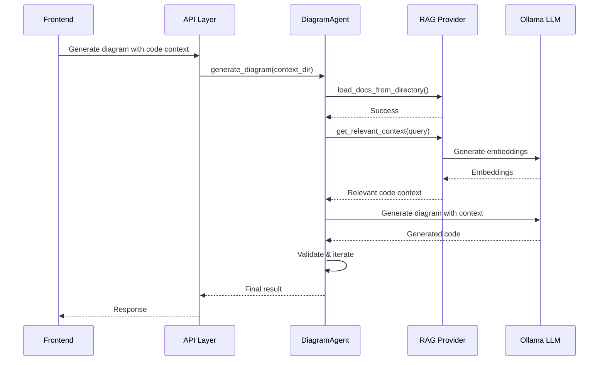
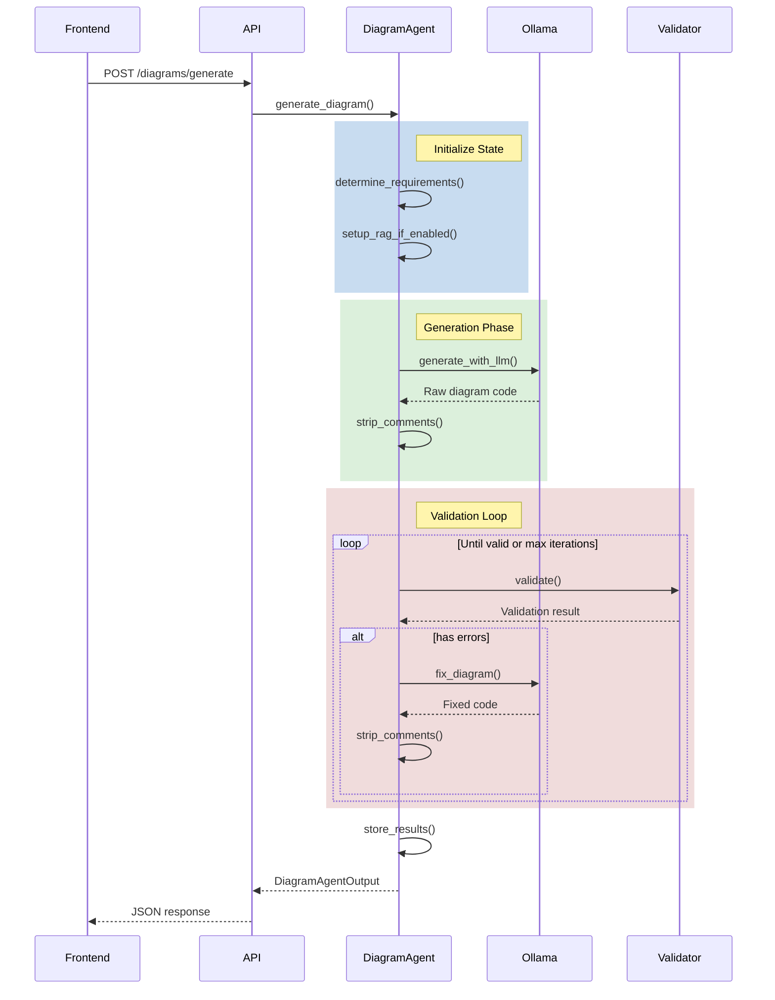

# Architecture Documentation

This document provides an overview of the core components and how they interact to generate, validate, and manage diagrams.

## System Architecture

### Components Overview

The system consists of four main layers:

1. **Frontend Layer** (`frontend/src/`)
   - React components for user interaction
   - State management with contexts
   - History tracking and versioning
   - Real-time diagram preview

2. **API Layer** (`backend/api/`)
   - FastAPI endpoints for operations
   - Data models and validation
   - Storage management
   - Error handling

3. **Agent Layer** (`backend/agents/`)
   - Tool-based diagram generation
   - Validation and iteration
   - RAG integration
   - LLM prompt management

4. **Storage Layer** (`backend/storage/`)
   - SQLite database integration
   - History persistence
   - Version tracking
   - Metadata management

### Component Details

#### DiagramAgent

The core component using a tool-based approach:

#### RAG Integration

### Generation and Validation Flow

## Key Design Decisions

1. **Tool-Based Architecture**
   - Modular tool functions for specific tasks
   - Clear separation of concerns
   - Easier testing and maintenance
   - Configurable validation rules

2. **RAG Integration**
   - Code-aware diagram generation
   - Contextual understanding
   - Better accuracy for technical diagrams
   - Configurable similarity thresholds

3. **State Management**
   - Immutable state objects
   - Clear progression tracking
   - Comprehensive error handling
   - Detailed generation logs

4. **Storage Strategy**
   - SQLite for persistence
   - Version tracking
   - Metadata storage
   - Efficient querying

## Testing Strategy

1. **Unit Tests**
   - Individual tool testing
   - State management
   - RAG functionality
   - Validation rules

2. **Integration Tests**
   - End-to-end flows
   - API endpoints
   - Storage operations
   - RAG integration

3. **Test Data**
   - Sample code repositories
   - Various diagram types
   - Error cases
   - Performance scenarios

## Future Considerations

1. **Scalability**
   - Distributed RAG storage
   - Caching improvements
   - Batch processing
   - Multiple LLM support

2. **Features**
   - Real-time collaboration
   - Diagram templates
   - Custom validation rules
   - Export options

3. **Monitoring**
   - LLM performance tracking
   - RAG effectiveness metrics
   - User interaction analytics
   - Error rate monitoring
