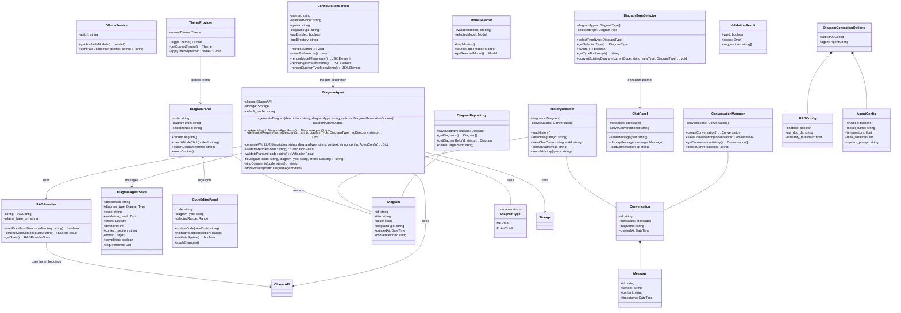

# Class Structure

```mermaid
classDiagram
    %% Backend Classes
    class OllamaService {
        -apiUrl: string
        +getAvailableModels(): Model[]
        +generateCompletion(prompt: string): string
    }

class DiagramAgent {
        -ollama: OllamaAPI
        -storage: Storage
        -default_model: string
        +generateDiagram(description: string, diagramType: string, options: DiagramGenerationOptions): DiagramAgentOutput
        -runAgent(input: DiagramAgentInput): DiagramAgentOutput
        -determineRequirements(description: string, diagramType: DiagramType, ragDirectory: string): Dict
        -generateWithLLM(description: string, diagramType: string, context: string, config: AgentConfig): Dict
        -validateMermaid(code: string): ValidationResult
        -validatePlantuml(code: string): ValidationResult
        -fixDiagram(code: string, diagramType: string, errors: List[str]): string
        -stripComments(code: string): string
        -storeResults(state: DiagramAgentState)
    }

    class RAGProvider {
        -config: RAGConfig
        -ollama_base_url: string
        +loadDocsFromDirectory(directory: string): boolean
        +getRelevantContext(query: string): SearchResult
        +getStats(): RAGProviderStats
    }

    class DiagramAgentState {
        +description: string
        +diagram_type: DiagramType
        +code: string
        +validation_result: Dict
        +errors: List[str]
        +iterations: int
        +context_section: string
        +notes: List[str]
        +completed: boolean
        +requirements: Dict
    }

    class ConversationManager {
        -conversations: Conversation[]
        +createConversation(): Conversation
        +saveConversation(conversation: Conversation)
        +getConversationHistory(): Conversation[]
        +deleteConversation(id: string)
    }

    class DiagramRepository {
        +saveDiagram(diagram: Diagram)
        +getDiagrams(): Diagram[]
        +getDiagramById(id: string): Diagram
        +deleteDiagram(id: string)
    }

    %% Frontend Classes
    class ConfigurationScreen {
        -prompt: string
        -selectedModel: string
        -syntax: string
        -diagramType: string
        -ragEnabled: boolean
        -ragDirectory: string
        +handleSubmit(): void
        +savePreferences(): void
        +renderModelMenuItems(): JSX.Element
        +renderSyntaxMenuItems(): JSX.Element
        +renderDiagramTypeMenuItems(): JSX.Element
    }

    class ThemeProvider {
        -currentTheme: Theme
        +toggleTheme(): void
        +getCurrentTheme(): Theme
        +applyTheme(theme: Theme): void
    }

    class DiagramPanel {
        -code: string
        -diagramType: string
        -selectedNode: string
        +renderDiagram()
        +handleNodeClick(nodeId: string)
        +exportDiagram(format: string)
        +zoomControl()
    }

    class CodeEditorPanel {
        -code: string
        -diagramType: string
        -selectedRange: Range
        +updateCode(newCode: string)
        +highlightSection(section: Range)
        +validateSyntax(): boolean
        +applyChanges()
    }

    class ChatPanel {
        -messages: Message[]
        -activeConversationId: string
        +sendMessage(text: string)
        +displayMessage(message: Message)
        +loadConversation(id: string)
    }

    class ModelSelector {
        -availableModels: Model[]
        -selectedModel: Model
        +loadModels()
        +selectModel(model: Model)
        +getSelectedModel(): Model
    }

    class HistoryBrowser {
        -diagrams: Diagram[]
        -conversations: Conversation[]
        +loadHistory()
        +selectDiagram(id: string)
        +viewChatContext(diagramId: string)
        +deleteDiagram(id: string)
        +searchHistory(query: string)
    }

    class DiagramTypeSelector {
        -diagramTypes: DiagramType[]
        -selectedType: DiagramType
        +selectType(type: DiagramType)
        +getSelectedType(): DiagramType
        +isAuto(): boolean
        +getTypeForPrompt(): string
        +convertExistingDiagram(currentCode: string, newType: DiagramType): void
    }

    %% Data Models
    class Diagram {
        +id: string
        +title: string
        +code: string
        +diagramType: string
        +createdAt: DateTime
        +conversationId: string
    }

    class Conversation {
        +id: string
        +messages: Message[]
        +diagramId: string
        +createdAt: DateTime
    }

    class Message {
        +id: string
        +sender: string
        +content: string
        +timestamp: DateTime
    }

    class ValidationResult {
        +valid: boolean
        +errors: Error[]
        +suggestions: string[]
    }

    %% Models
    class DiagramType {
        <<enumeration>>
        MERMAID
        PLANTUML
    }

    class DiagramGenerationOptions {
        +rag: RAGConfig
        +agent: AgentConfig
    }

    class RAGConfig {
        +enabled: boolean
        +api_doc_dir: string
        +similarity_threshold: float
    }

    class AgentConfig {
        +enabled: boolean
        +model_name: string
        +temperature: float
        +max_iterations: int
        +system_prompt: string
    }

    %% Relationships
    DiagramAgent --> OllamaAPI : uses
    DiagramAgent --> Storage : uses
    DiagramAgent --> RAGProvider : uses
    DiagramAgent --> DiagramAgentState : manages
    DiagramAgent -- DiagramType : uses
    ConfigurationScreen --> DiagramAgent : triggers generation
    RAGProvider --> OllamaAPI : uses for embeddings
    DiagramGenerationOptions *-- RAGConfig
    DiagramGenerationOptions *-- AgentConfig
    DiagramRepository -- Diagram
    ConversationManager -- Conversation
    Conversation *-- Message
    DiagramPanel <-- CodeEditorPanel : highlights
    ChatPanel -- Conversation
    HistoryBrowser -- Diagram
    HistoryBrowser -- Conversation
    DiagramPanel -- Diagram : renders
    DiagramTypeSelector --> ChatPanel : enhances prompt
    ThemeProvider --> DiagramPanel : applies theme
```
