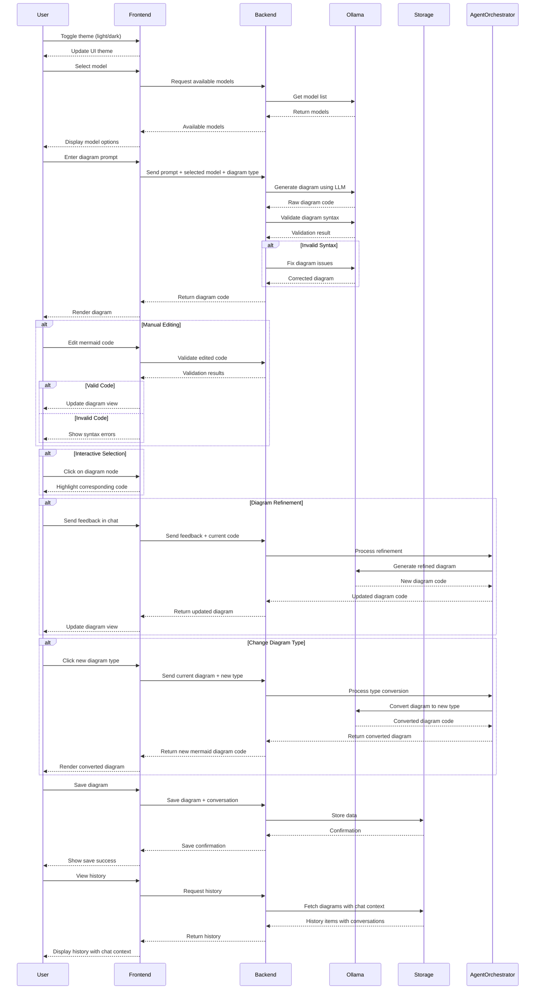

# Data Flow

```mermaid
sequenceDiagram
    participant User
    participant Frontend
    participant Backend
    participant Ollama
    participant Storage
    
    User->>Frontend: Toggle theme (light/dark)
    Frontend-->>User: Update UI theme
    
    User->>Frontend: Select model
    Frontend->>Backend: Request available models
    Backend->>Ollama: Get model list
    Ollama-->>Backend: Return models
    Backend-->>Frontend: Available models
    Frontend-->>User: Display model options
    
    User->>Frontend: Enter diagram prompt
    Frontend->>Backend: Send prompt + selected model + diagram type
    Backend->>Ollama: Generate diagram using LLM
    Ollama-->>Backend: Raw diagram code
    Backend->>Ollama: Validate diagram syntax
    Ollama-->>Backend: Validation result
    
    alt Invalid Syntax
        Backend->>Ollama: Fix diagram issues
        Ollama-->>Backend: Corrected diagram
    end
    
    Backend-->>Frontend: Return diagram code
    Frontend-->>User: Render diagram
    
    alt Manual Editing
        User->>Frontend: Edit mermaid code
        Frontend->>Backend: Validate edited code
        Backend-->>Frontend: Validation results
        alt Valid Code
            Frontend-->>User: Update diagram view
        else Invalid Code
            Frontend-->>User: Show syntax errors
        end
    end
    
    alt Interactive Selection
        User->>Frontend: Click on diagram node
        Frontend-->>User: Highlight corresponding code
    end
    
    alt Diagram Refinement
        User->>Frontend: Send feedback in chat
        Frontend->>Backend: Send feedback + current code
        Backend->>AgentOrchestrator: Process refinement
        AgentOrchestrator->>Ollama: Generate refined diagram
        Ollama-->>AgentOrchestrator: New diagram code
        AgentOrchestrator-->>Backend: Updated diagram code
        Backend-->>Frontend: Return updated diagram
        Frontend-->>User: Update diagram view
    end
    
    alt Change Diagram Type
        User->>Frontend: Click new diagram type
        Frontend->>Backend: Send current diagram + new type
        Backend->>AgentOrchestrator: Process type conversion
        AgentOrchestrator->>Ollama: Convert diagram to new type
        Ollama-->>AgentOrchestrator: Converted diagram code
        AgentOrchestrator-->>Backend: Return converted diagram
        Backend-->>Frontend: Return new mermaid diagram code
        Frontend-->>User: Render converted diagram
    end
    
    User->>Frontend: Save diagram
    Frontend->>Backend: Save diagram + conversation
    Backend->>Storage: Store data
    Storage-->>Backend: Confirmation
    Backend-->>Frontend: Save confirmation
    Frontend-->>User: Show save success
    
    User->>Frontend: View history
    Frontend->>Backend: Request history
    Backend->>Storage: Fetch diagrams with chat context
    Storage-->>Backend: History items with conversations
    Backend-->>Frontend: Return history
    Frontend-->>User: Display history with chat context
```
