# Data Flow

```mermaid
sequenceDiagram
    participant User
    participant Frontend
    participant Backend
    participant DiagramAgent
    participant RAG
    participant Ollama
    participant Storage
    
    %% Initial Setup
    User->>Frontend: Configure settings
    Frontend-->>User: Show available options
    
    %% RAG Setup
    User->>Frontend: Select code directory
    Frontend->>Backend: Set RAG directory
    Backend->>DiagramAgent: Configure RAG
    DiagramAgent->>RAG: Initialize with directory
    RAG->>RAG: Process and index files
    RAG-->>DiagramAgent: Ready for queries
    
    %% Diagram Generation
    User->>Frontend: Enter diagram prompt
    Frontend->>Backend: Send prompt + options
    Backend->>DiagramAgent: Generate diagram
    
    %% Requirements Phase
    DiagramAgent->>DiagramAgent: Determine requirements
    opt RAG Enabled
        DiagramAgent->>DiagramAgent: Enhance query
        DiagramAgent->>RAG: Get relevant context
        RAG->>Ollama: Generate embeddings
        Ollama-->>RAG: Embeddings
        RAG-->>DiagramAgent: Code context
        Frontend-->>User: Update status: "Analyzing Code"
    end
    
    %% Generation Phase
    DiagramAgent->>Ollama: Generate diagram
    Frontend-->>User: Update status: "Generating"
    Ollama-->>DiagramAgent: Raw diagram code
    DiagramAgent->>DiagramAgent: Strip comments
    
    %% Validation Phase
    Frontend-->>User: Update status: "Validating"
    loop Until valid or max iterations
        DiagramAgent->>DiagramAgent: Validate syntax
        
        alt has errors
            Frontend-->>User: Update status: "Fixing Issues"
            DiagramAgent->>Ollama: Fix diagram
            Ollama-->>DiagramAgent: Fixed code
            DiagramAgent->>DiagramAgent: Strip comments
        end
    end
    
    %% Storage and Response
    DiagramAgent->>Storage: Store diagram & metadata
    DiagramAgent-->>Backend: Return result
    Backend-->>Frontend: Return diagram code
    Frontend-->>User: Render diagram
    Frontend-->>User: Clear status
    
    %% Manual Editing
    alt Edit Existing
        User->>Frontend: Edit diagram code
        Frontend->>Backend: Validate changes
        Backend->>DiagramAgent: Validate syntax
        DiagramAgent-->>Backend: Validation results
        alt Valid Code
            Frontend-->>User: Update diagram view
        else Invalid Code
            Frontend-->>User: Show errors
        end
    end
    
    %% Diagram Update
    alt Update Existing
        User->>Frontend: Send update prompt
        Frontend->>Backend: Update diagram request
        Backend->>Storage: Get existing diagram
        Storage-->>Backend: Diagram record
        Backend->>DiagramAgent: Update diagram
        
        DiagramAgent->>Ollama: Generate update
        Ollama-->>DiagramAgent: Updated code
        DiagramAgent->>DiagramAgent: Validate & fix
        DiagramAgent->>Storage: Save updated diagram
        
        DiagramAgent-->>Backend: Return updated diagram
        Backend-->>Frontend: Return new code
        Frontend-->>User: Show updated diagram
    end
    
    %% History Management
    alt View History
        User->>Frontend: Open history view
        Frontend->>Backend: Get diagram history
        Backend->>Storage: Fetch diagrams
        Storage-->>Backend: Diagram records
        Backend-->>Frontend: History with metadata
        Frontend-->>User: Display history
        
        alt Select Historical Diagram
            User->>Frontend: Click diagram
            Frontend->>Backend: Get diagram details
            Backend->>Storage: Fetch full record
            Storage-->>Backend: Complete record
            Backend-->>Frontend: Full diagram data
            Frontend-->>User: Show diagram details
        end
        
        alt Delete Diagram
            User->>Frontend: Delete diagram
            Frontend->>Backend: Delete request
            Backend->>Storage: Remove diagram
            Storage-->>Backend: Success
            Backend-->>Frontend: Confirmation
            Frontend-->>User: Update history view
        end
    end
```

## Notes

1. **Status Updates**
   - Frontend shows current activity in status bar
   - Each phase has descriptive status messages
   - Error states are clearly communicated

2. **RAG Integration**
   - Code context enhances diagram accuracy
   - Embeddings improve context relevance
   - Query enhancement for better matches

3. **Tool-Based Generation**
   - Systematic validation approach
   - Iterative improvement cycle
   - Clear error handling

4. **Storage Integration**
   - Complete history tracking
   - Metadata preservation
   - Quick retrieval options

5. **User Interaction**
   - Real-time validation
   - Interactive editing
   - History management
   - Status feedback
