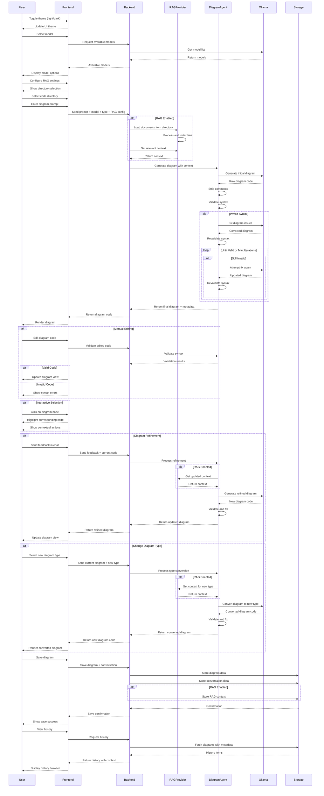

# Data Flow

```mermaid
sequenceDiagram
    participant User
    participant Frontend
    participant Backend
    participant RAGProvider
    participant DiagramAgent
    participant Ollama
    participant Storage
    
    User->>Frontend: Toggle theme (light/dark)
    Frontend-->>User: Update UI theme
    
    User->>Frontend: Select model
    Frontend->>Backend: Request available models
    Backend->>Ollama: Get model list
    Ollama-->>Backend: Return models
    Backend-->>Frontend: Available models
    Frontend-->>User: Display model options
    
    User->>Frontend: Configure RAG settings
    Frontend-->>User: Show directory selection
    User->>Frontend: Select code directory
    
    User->>Frontend: Enter diagram prompt
    Frontend->>Backend: Send prompt + model + type + RAG config
    
    alt RAG Enabled
        Backend->>RAGProvider: Load documents from directory
        RAGProvider->>RAGProvider: Process and index files
        Backend->>RAGProvider: Get relevant context
        RAGProvider-->>Backend: Return context
    end
    
    Backend->>DiagramAgent: Generate diagram with context
    DiagramAgent->>Ollama: Generate initial diagram
    Ollama-->>DiagramAgent: Raw diagram code
    
    DiagramAgent->>DiagramAgent: Strip comments
    DiagramAgent->>DiagramAgent: Validate syntax
    
    alt Invalid Syntax
        DiagramAgent->>Ollama: Fix diagram issues
        Ollama-->>DiagramAgent: Corrected diagram
        DiagramAgent->>DiagramAgent: Revalidate syntax
        
        loop Until Valid or Max Iterations
            alt Still Invalid
                DiagramAgent->>Ollama: Attempt fix again
                Ollama-->>DiagramAgent: Updated diagram
                DiagramAgent->>DiagramAgent: Revalidate syntax
            end
        end
    end
    
    DiagramAgent-->>Backend: Return final diagram + metadata
    Backend-->>Frontend: Return diagram code
    Frontend-->>User: Render diagram
    
    alt Manual Editing
        User->>Frontend: Edit diagram code
        Frontend->>Backend: Validate edited code
        Backend->>DiagramAgent: Validate syntax
        DiagramAgent-->>Backend: Validation results
        alt Valid Code
            Frontend-->>User: Update diagram view
        else Invalid Code
            Frontend-->>User: Show syntax errors
        end
    end
    
    alt Interactive Selection
        User->>Frontend: Click on diagram node
        Frontend-->>User: Highlight corresponding code
        Frontend-->>User: Show contextual actions
    end
    
    alt Diagram Refinement
        User->>Frontend: Send feedback in chat
        Frontend->>Backend: Send feedback + current code
        Backend->>DiagramAgent: Process refinement
        
        alt RAG Enabled
            DiagramAgent->>RAGProvider: Get updated context
            RAGProvider-->>DiagramAgent: Return context
        end
        
        DiagramAgent->>Ollama: Generate refined diagram
        Ollama-->>DiagramAgent: New diagram code
        DiagramAgent->>DiagramAgent: Validate and fix
        DiagramAgent-->>Backend: Return updated diagram
        Backend-->>Frontend: Return refined diagram
        Frontend-->>User: Update diagram view
    end
    
    alt Change Diagram Type
        User->>Frontend: Select new diagram type
        Frontend->>Backend: Send current diagram + new type
        Backend->>DiagramAgent: Process type conversion
        
        alt RAG Enabled
            DiagramAgent->>RAGProvider: Get context for new type
            RAGProvider-->>DiagramAgent: Return context
        end
        
        DiagramAgent->>Ollama: Convert diagram to new type
        Ollama-->>DiagramAgent: Converted diagram code
        DiagramAgent->>DiagramAgent: Validate and fix
        DiagramAgent-->>Backend: Return converted diagram
        Backend-->>Frontend: Return new diagram code
        Frontend-->>User: Render converted diagram
    end
    
    User->>Frontend: Save diagram
    Frontend->>Backend: Save diagram + conversation
    Backend->>Storage: Store diagram data
    Backend->>Storage: Store conversation data
    alt RAG Enabled
        Backend->>Storage: Store RAG context
    end
    Storage-->>Backend: Confirmation
    Backend-->>Frontend: Save confirmation
    Frontend-->>User: Show save success
    
    User->>Frontend: View history
    Frontend->>Backend: Request history
    Backend->>Storage: Fetch diagrams with metadata
    Storage-->>Backend: History items
    Backend-->>Frontend: Return history with context
    Frontend-->>User: Display history browser
```
