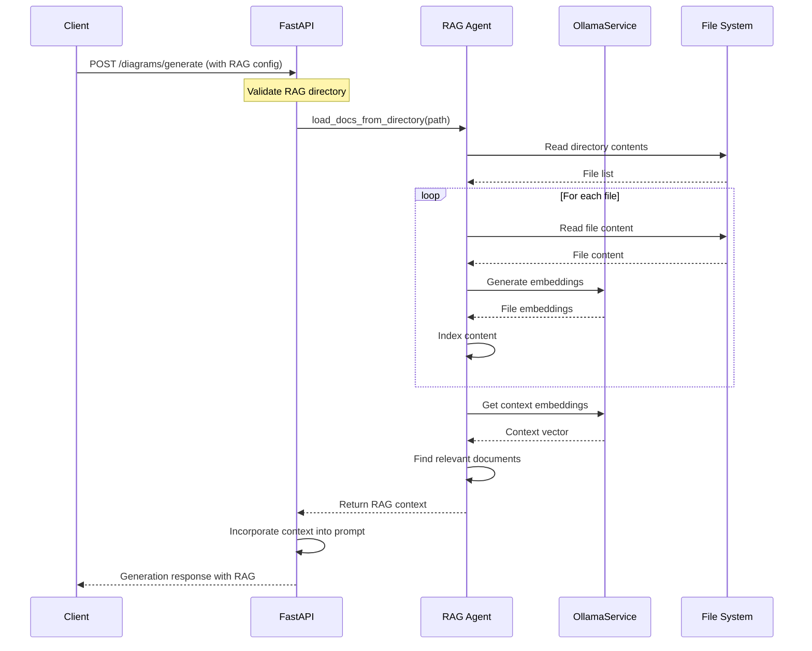
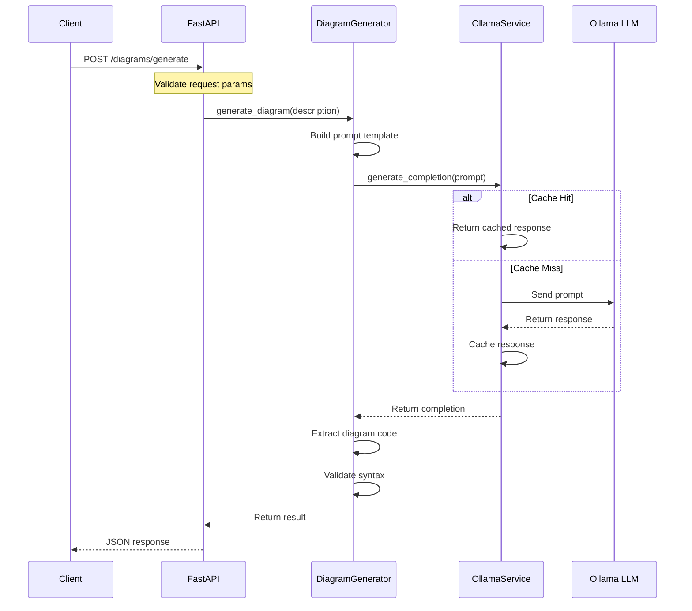
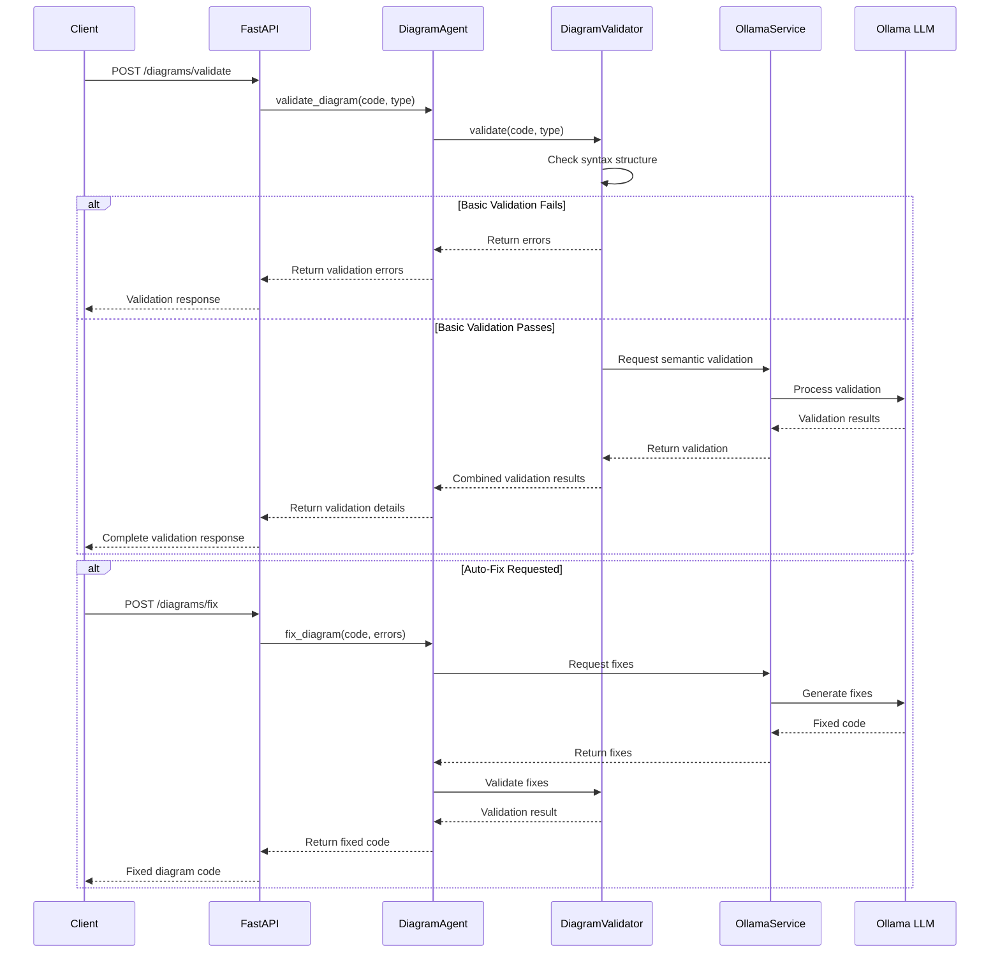
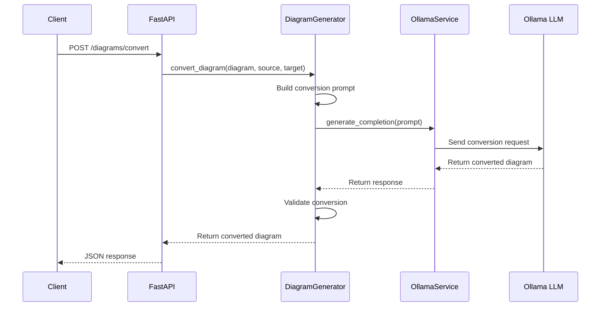
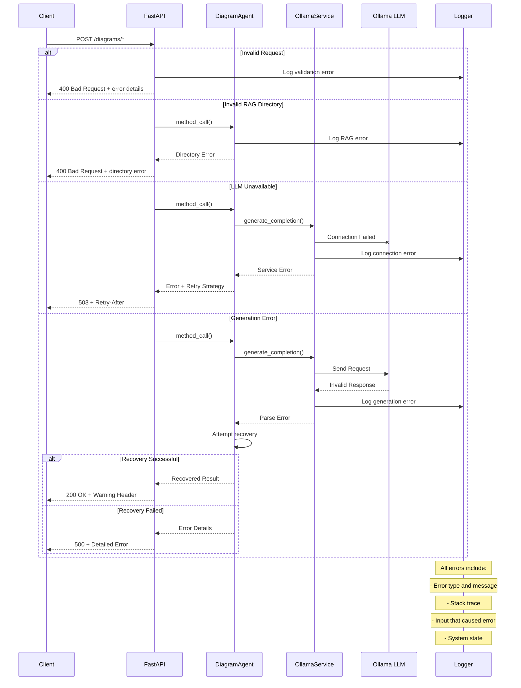

# Sequence Diagrams: Core Flows

This document contains sequence diagrams illustrating the main flows in the system.

## 1. RAG Integration Flow

## 2. Diagram Generation Flow

## 3. Diagram Validation Flow

## 4. Diagram Conversion Flow

## 5. Error Handling Flow

## Notes

1. All flows use async/await for better performance
2. Error handling is implemented at each layer
3. Caching is used where appropriate to improve response times
4. Validation occurs after generation and conversion
5. Each component has specific responsibilities:
   - API: Request handling and response formatting
   - DiagramGenerator: Business logic and orchestration
   - OllamaService: LLM communication and caching
