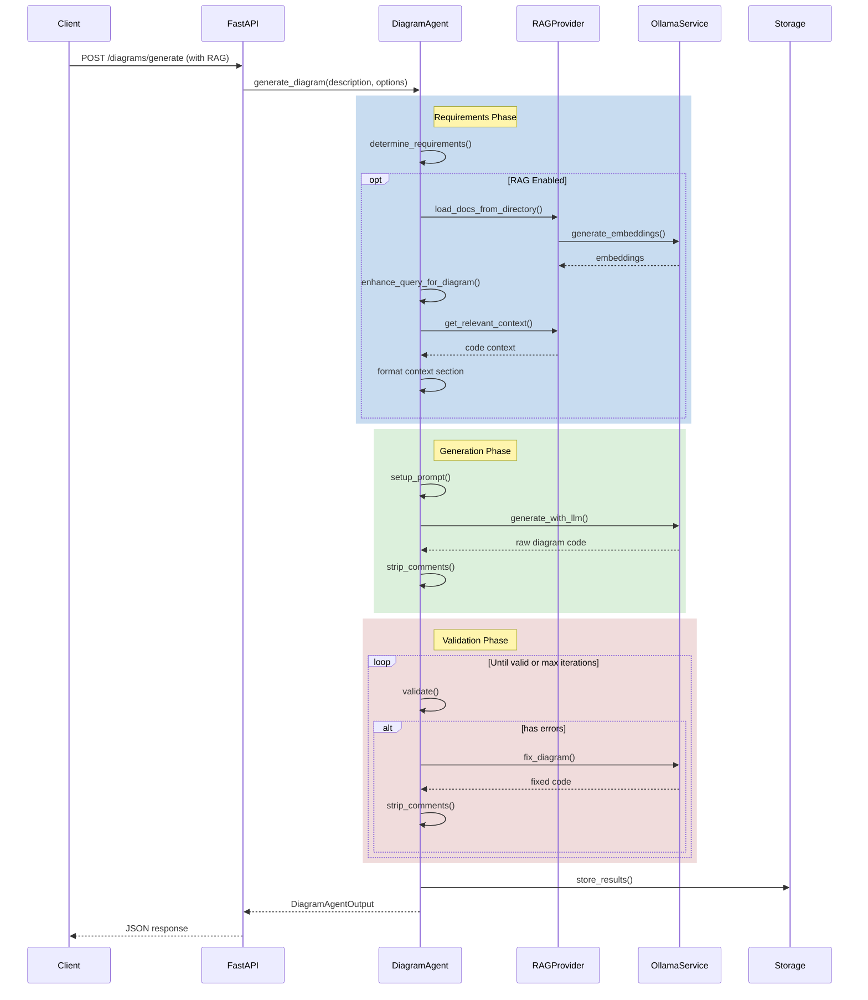
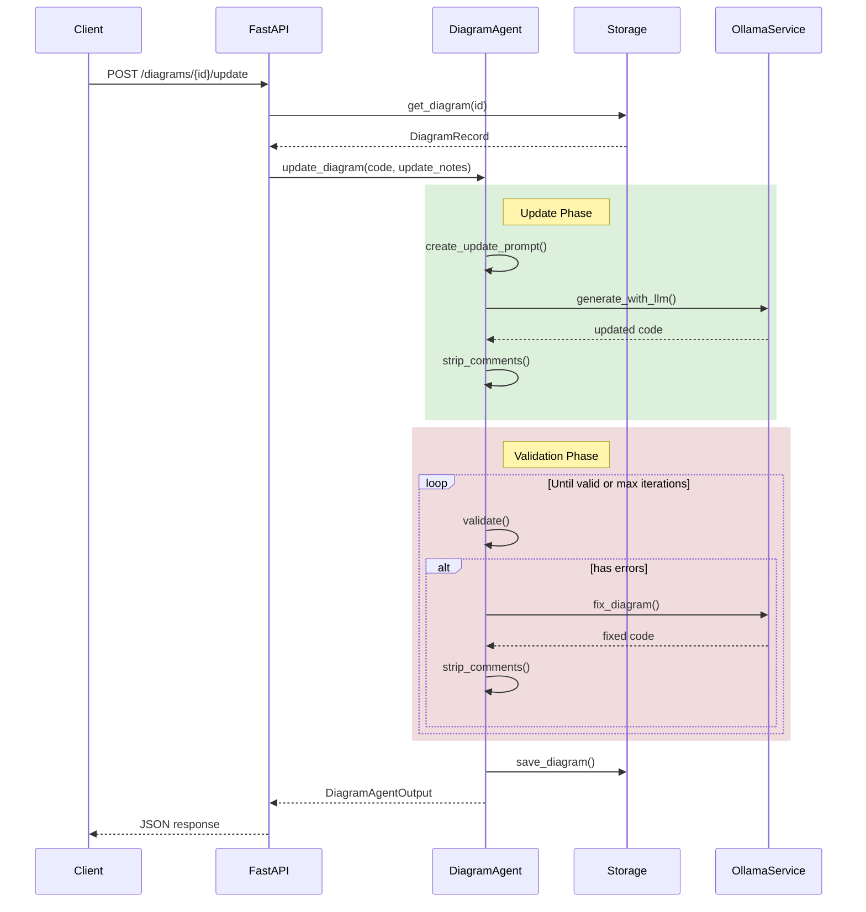
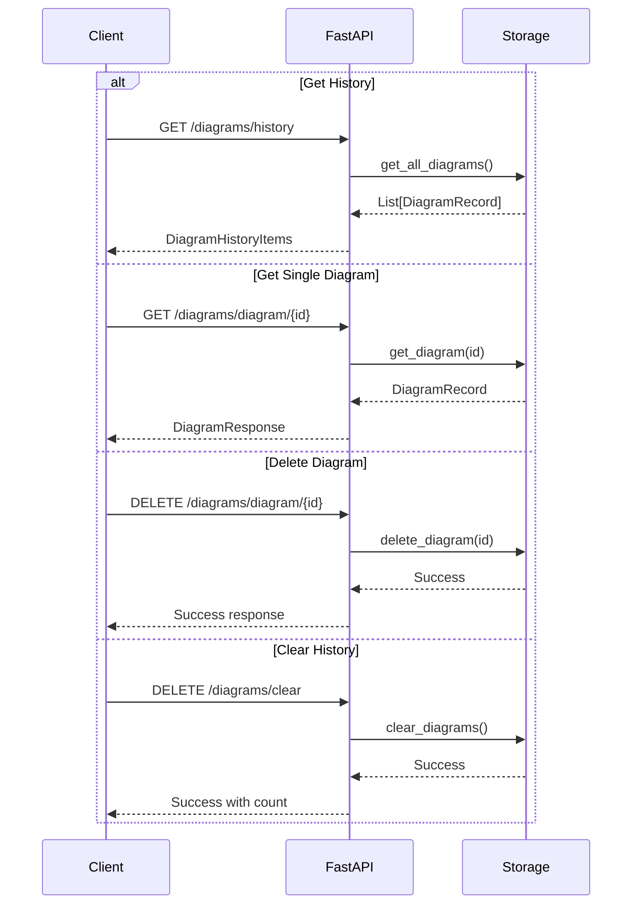
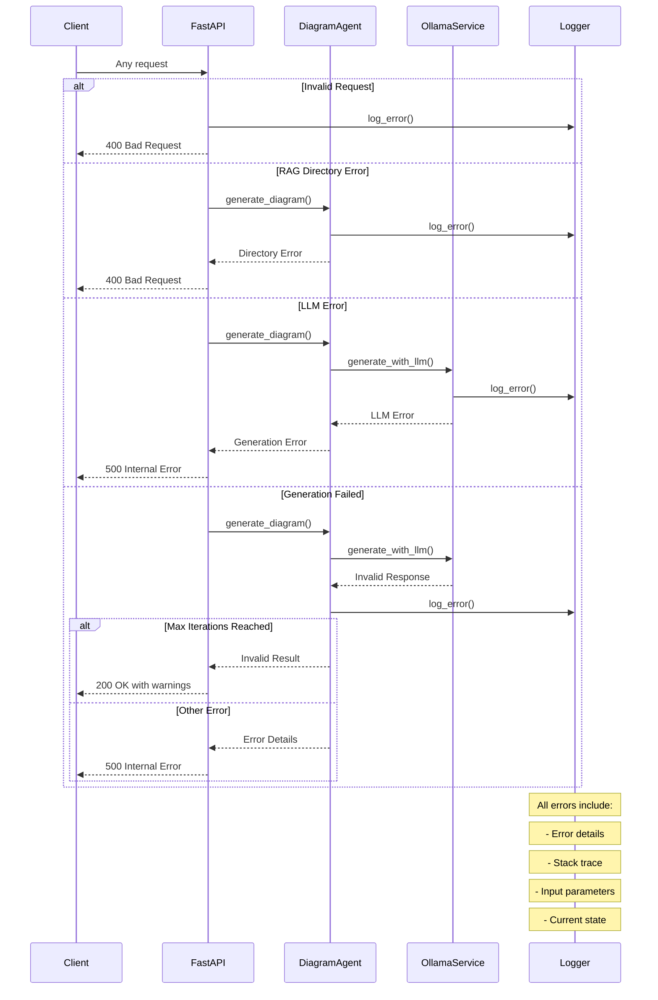

# Sequence Diagrams: Core Flows

This document contains sequence diagrams illustrating the main flows in the system.

## 1. Diagram Generation with RAG

## 2. Diagram Update Flow

## 3. History Management Flow

## 4. Error Handling Flow

## Notes

1. The tool-based approach in DiagramAgent provides:
   - Clear separation of concerns
   - Systematic validation and iteration
   - Detailed logging and error tracking
   - Configurable behavior

2. RAG integration enables:
   - Code-aware diagram generation
   - Context-sensitive refinements
   - Improved accuracy
   - Enhanced prompts

3. State management ensures:
   - Reliable progression tracking
   - Comprehensive error handling
   - Detailed generation logs
   - Proper cleanup

4. Storage integration provides:
   - Persistent diagram history
   - Version tracking
   - Metadata management
   - Quick retrieval
