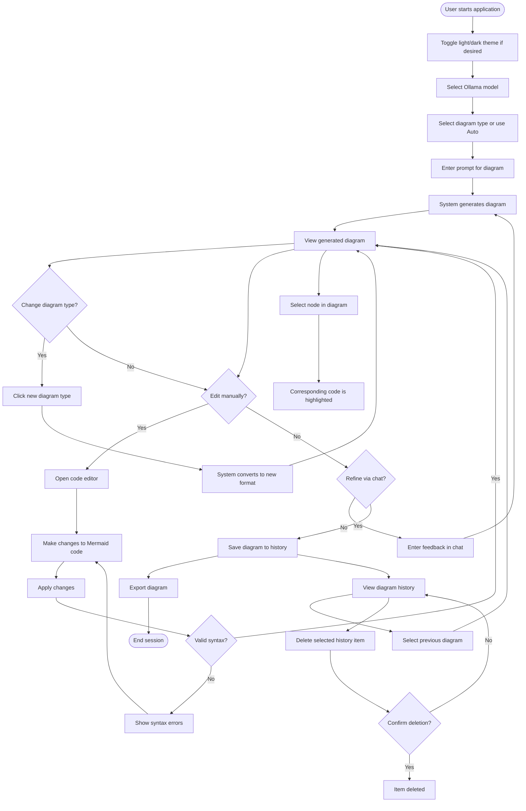

# User Journey

```mermaid
flowchart TD
    Start([User starts application]) --> SelectTheme[Toggle light/dark theme if desired]
    SelectTheme --> SelectModel[Select Ollama model]
    SelectModel --> SelectDiagramType[Select diagram type or use Auto]
    SelectDiagramType --> EnterPrompt[Enter prompt for diagram]
    EnterPrompt --> GenerateDiagram[System generates diagram]
    GenerateDiagram --> ViewDiagram[View generated diagram]
    
    ViewDiagram --> ChangeDiagramType{Change diagram type?}
    ChangeDiagramType -- Yes --> ClickNewType[Click new diagram type]
    ClickNewType --> ConvertDiagram[System converts to new format]
    ConvertDiagram --> ViewDiagram
    
    ViewDiagram --> EditManually{Edit manually?}
    EditManually -- Yes --> OpenCodeEditor[Open code editor]
    OpenCodeEditor --> MakeChanges[Make changes to Mermaid code]
    MakeChanges --> ApplyChanges[Apply changes]
    ApplyChanges --> ValidateChanges{Valid syntax?}
    ValidateChanges -- Yes --> ViewDiagram
    ValidateChanges -- No --> ShowErrors[Show syntax errors]
    ShowErrors --> MakeChanges
    
    ChangeDiagramType -- No --> EditManually
    
    ViewDiagram --> SelectNode[Select node in diagram]
    SelectNode --> HighlightCode[Corresponding code is highlighted]
    
    EditManually -- No --> RefinePrompt{Refine via chat?}
    RefinePrompt -- Yes --> EnterFeedback[Enter feedback in chat]
    EnterFeedback --> GenerateDiagram
    
    RefinePrompt -- No --> SaveDiagram[Save diagram to history]
    SaveDiagram --> ExportOptions[Export diagram]
    SaveDiagram --> ViewHistory[View diagram history]
    ViewHistory --> SelectOldDiagram[Select previous diagram]
    SelectOldDiagram --> ViewDiagram
    
    ViewHistory --> DeleteHistory[Delete selected history item]
    DeleteHistory --> ConfirmDelete{Confirm deletion?}
    ConfirmDelete -- Yes --> HistoryDeleted[Item deleted]
    ConfirmDelete -- No --> ViewHistory
    
    ExportOptions --> End([End session])
```
