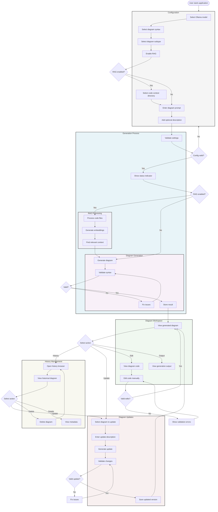

# User Journey

## Key Features

1. **Configuration**
   - Model selection
   - Diagram syntax and subtype selection
   - RAG configuration
   - Prompt and description entry

2. **Status Updates**
   - Real-time status indicator
   - Generation progress
   - Error notifications
   - Success confirmation

3. **RAG Integration**
   - Directory selection
   - File processing
   - Context matching
   - Enhanced generation

4. **Workspace Features**
   - Diagram visualization
   - Code editing
   - Output logging
   - Manual validation

5. **History Management**
   - Browse historical diagrams
   - View metadata
   - Delete diagrams
   - Update existing diagrams

6. **Update Flow**
   - Select diagram to update
   - Describe changes
   - Validate updates
   - Save new version
