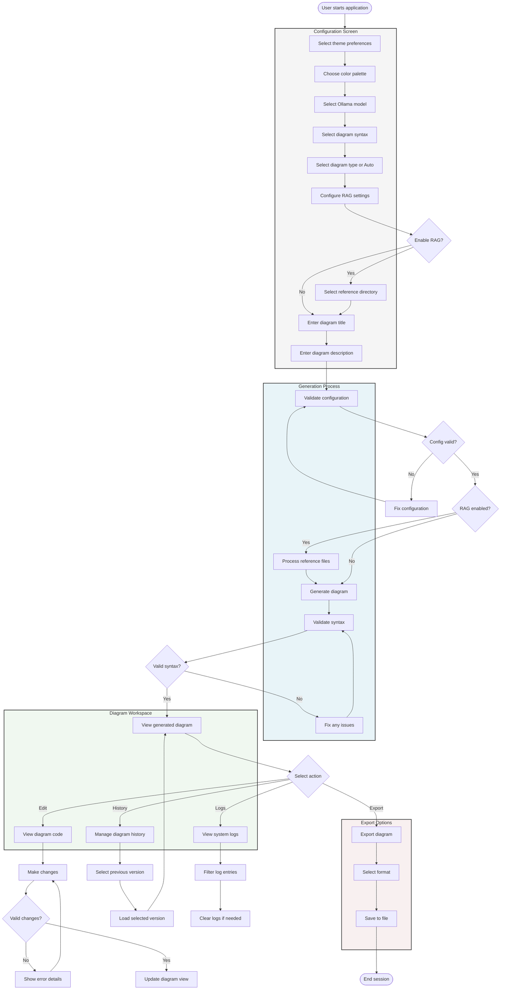

# User Journey

```mermaid
flowchart TD
    Start([User starts application])
    
    subgraph ConfigScreen[Configuration Screen]
        SelectTheme[Select theme preferences]
        SelectPalette[Choose color palette]
        SelectModel[Select Ollama model]
        SelectSyntax[Select diagram syntax]
        SelectDiagramType[Select diagram type or Auto]
        ConfigureRAG[Configure RAG settings]
        SelectDirectory[Select reference directory]
        EnterTitle[Enter diagram title]
        EnterPrompt[Enter diagram description]
    end
    
    subgraph Generation[Generation Process]
        ValidateConfig[Validate configuration]
        ProcessRAG[Process reference files]
        GenerateDiagram[Generate diagram]
        ValidateSyntax[Validate syntax]
        FixIssues[Fix any issues]
    end
    
    subgraph Workspace[Diagram Workspace]
        ViewDiagram[View generated diagram]
        ViewCode[View diagram code]
        ManageHistory[Manage diagram history]
        ViewLogs[View system logs]
    end
    
    Start --> ConfigScreen
    
    SelectTheme --> SelectPalette
    SelectPalette --> SelectModel
    SelectModel --> SelectSyntax
    SelectSyntax --> SelectDiagramType
    SelectDiagramType --> ConfigureRAG
    
    ConfigureRAG --> RAGDecision{Enable RAG?}
    RAGDecision -- Yes --> SelectDirectory
    RAGDecision -- No --> EnterTitle
    SelectDirectory --> EnterTitle
    
    EnterTitle --> EnterPrompt
    EnterPrompt --> ValidateConfig
    
    ValidateConfig --> ConfigValid{Config valid?}
    ConfigValid -- No --> FixConfig[Fix configuration]
    FixConfig --> ValidateConfig
    ConfigValid -- Yes --> RAGEnabled{RAG enabled?}
    
    RAGEnabled -- Yes --> ProcessRAG
    ProcessRAG --> GenerateDiagram
    RAGEnabled -- No --> GenerateDiagram
    
    GenerateDiagram --> ValidateSyntax
    ValidateSyntax --> SyntaxValid{Valid syntax?}
    SyntaxValid -- No --> FixIssues
    FixIssues --> ValidateSyntax
    SyntaxValid -- Yes --> ViewDiagram
    
    ViewDiagram --> DiagramOptions{Select action}
    DiagramOptions -- Edit --> ViewCode
    DiagramOptions -- History --> ManageHistory
    DiagramOptions -- Logs --> ViewLogs
    
    ViewCode --> EditCode[Make changes]
    EditCode --> ValidateEdit{Valid changes?}
    ValidateEdit -- No --> ShowErrors[Show error details]
    ShowErrors --> EditCode
    ValidateEdit -- Yes --> UpdateView[Update diagram view]
    
    ManageHistory --> SelectVersion[Select previous version]
    SelectVersion --> LoadVersion[Load selected version]
    LoadVersion --> ViewDiagram
    
    ViewLogs --> FilterLogs[Filter log entries]
    FilterLogs --> ClearLogs[Clear logs if needed]
    
    subgraph Export[Export Options]
        ExportDiagram[Export diagram]
        SelectFormat[Select format]
        SaveFile[Save to file]
    end
    
    DiagramOptions -- Export --> ExportDiagram
    ExportDiagram --> SelectFormat
    SelectFormat --> SaveFile
    SaveFile --> End([End session])
    
    style ConfigScreen fill:#f5f5f5,stroke:#333,stroke-width:2px
    style Generation fill:#e8f4f8,stroke:#333,stroke-width:2px
    style Workspace fill:#f0f8f0,stroke:#333,stroke-width:2px
    style Export fill:#f8f0f0,stroke:#333,stroke-width:2px
```
